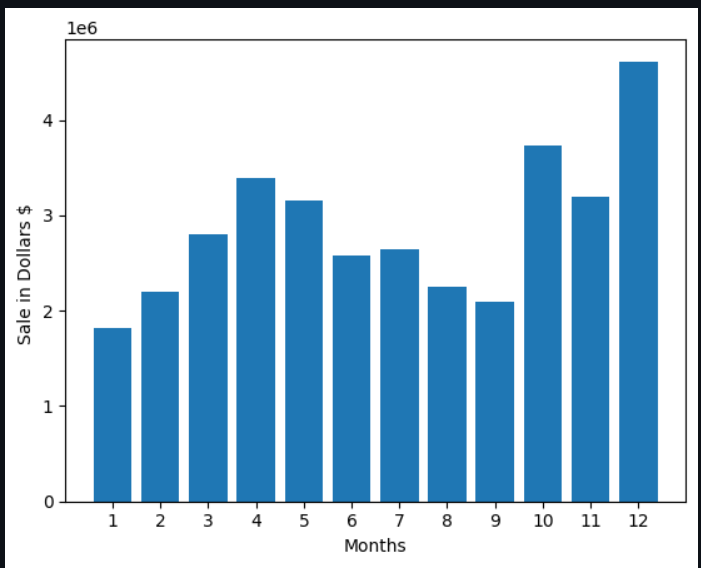
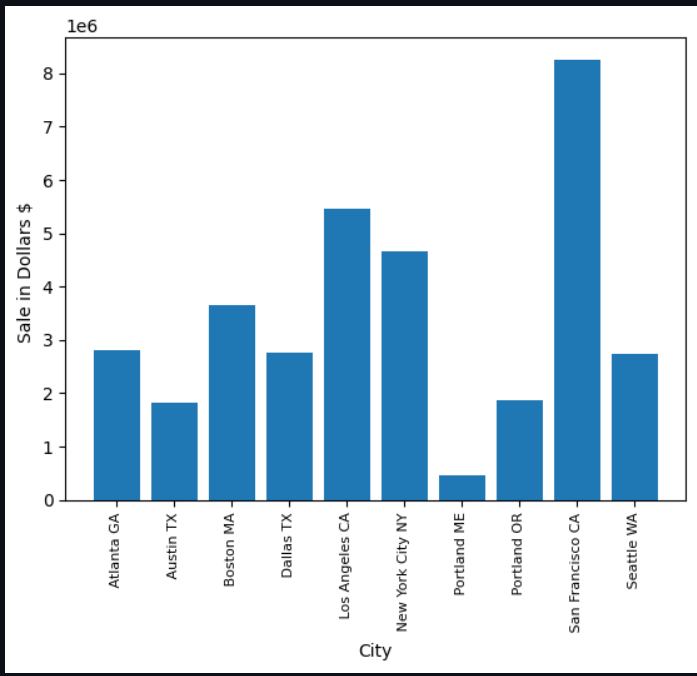
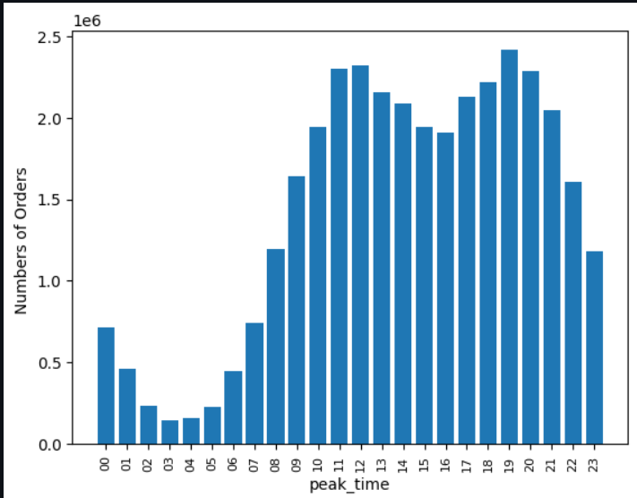
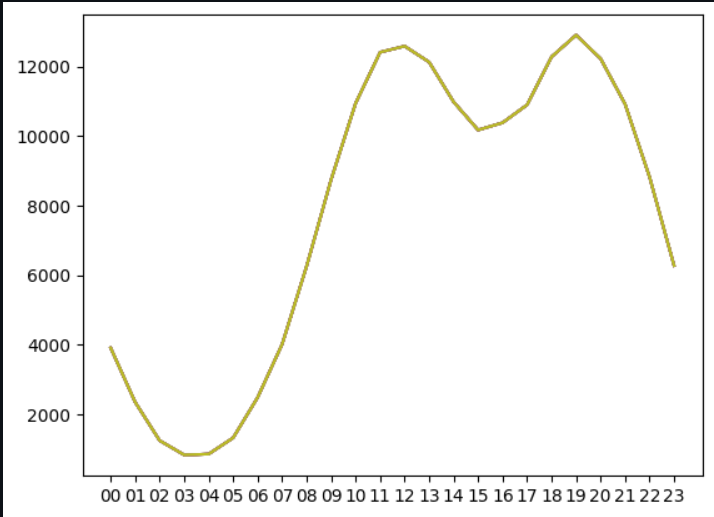
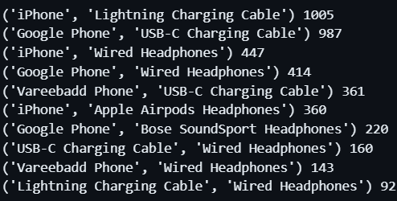
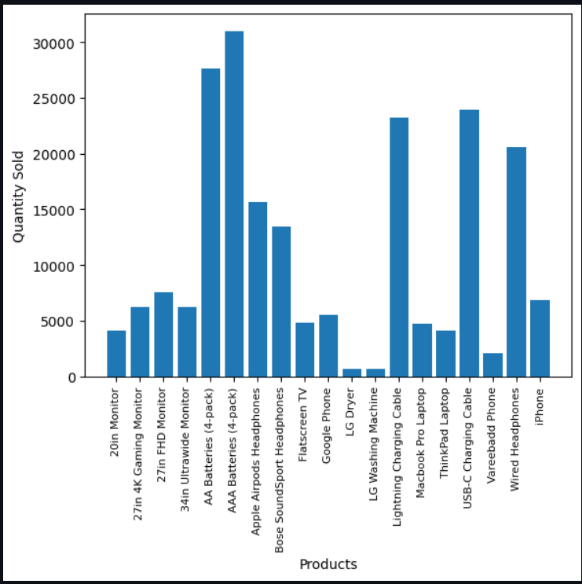
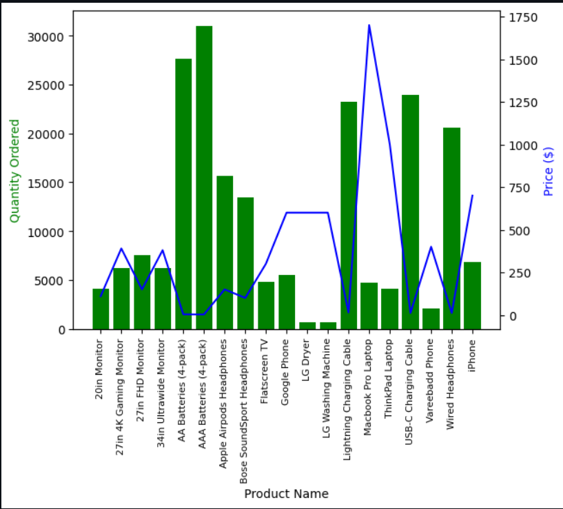

### Analysis done on sales in USA in the Year 2019.

Files Included: jupyter notebook(analysis.ipynb) with all code with comments explaining the code and methods.
                all_data.csv file with data of all 12 months of year 2019 combined.
                Attaching all 12 months file for refernece.

## This file answers to five main questions:

# Question 1: What are the best months for sales? How much was earned that month?
My answer:

# Question 2: What city sold the most products?
My answer:

# Question 3: What time should we diplay advertisments so that Customer will buy more products?
My answer:

# Question 4: What Products are most often sold together?
My answer:

# Question 5: What Product sold the most? Why do you think it sold the most?
My aswer:

The last image conveys the relationship between Prices and Products sold. (In general: prices ∝ (1/Items sold)).

Credits To: https://github.com/KeithGalli (Big Fan Sir 🫡) 
